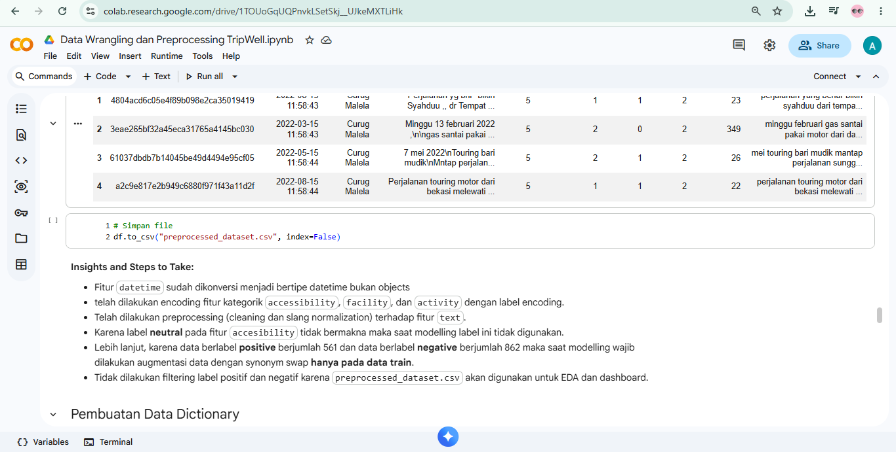
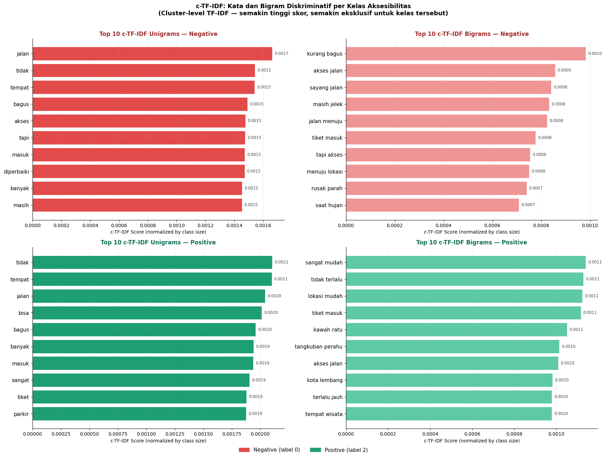

# Tripwell Capstone Contribution

## Project Description:
TripWell is an AI-powered inclusive tourism platform designed to help users identify whether a tourist destination is accessible for people with mobility limitations, such as wheelchair users, elderly visitors, and families with strollers.

This project focuses on analyzing Indonesian tourism reviews using Deep Learning and Natural Language Processing (NLP) techniques.

The AI system automatically classifies tourism reviews into:

- **Ramah Disabilitas** (Accessible)
- **Akses Terbatas** (Limited Accessibility)

This project was developed for:

> Coding Camp 2026 powered by DBS Foundation

## My Role:
Data Analysis & Data Preprocessing

## Contributions:

- Data Wrangling : Original data source is https://www.kaggle.com/datasets/dzzlr07/absa-natural-tourist-attractions-review using Google Colab i assess the quality of the raw data.
- Cleaning Data: Ensure all data has no missing values, duplicates, and label encoding of 'accessibility', 'facility', and 'activity' using label encoder because poitive > neutral > negative
- Text data preprocessing (For modelling): basic cleaning of text data, slang normalization, quality checking ensuring data is fit for modelling with BiLSTM

- Exploratory Data Analysis (EDA)
- Data visualization

## Insights:
* **Top Negative Accessibility Location:** **Curug Malela** is a significant outlier with the highest proportion of negative accessibility reviews (**52.5%**), making it the only destination where negative sentiment is dominant. In contrast, the other top-4 lowest-rated locations (Bukit Senyum, Curug Layung, Stone Garden, and Sanghyang Heuleut) are dominated by neutral reviews (77%–81%). These locations correlate with lower-to-mid average ratings (4.39–4.56) compared to the overall dataset average of 4.5.
* **Discriminative Linguistic Patterns (c-TF-IDF):** Negative reviews are explicitly driven by infrastructure issues, dominated by unigrams like `jalan` (road) and `akses` (access), and highly discriminative bigrams such as `kurang bagus` (not good), `masih jelek` (still bad), and `saat hujan` (during rain). Conversely, positive reviews focus on convenience, utilizing bigrams like `sangat mudah` (very easy) and `lokasi mudah` (easy location). The phrase `tiket masuk` (entrance ticket) appears distinctively across both classes, acting as a polarized sentiment driver.
* **Temporal and Seasonal Trends (2019–2023):** Accessibility sentiment proportions and average monthly ratings remained highly stable without explicit seasonal patterns. However, a massive drop in monthly review volume occurred in mid-2022 (falling from ~1,850 to ~200 reviews), likely due to post-pandemic restrictions. This volume drop caused higher statistical volatility in ratings and sentiment proportions during the 2022–2023 period.

## Project Repository:
[(link repository utama)](https://github.com/lailykhoiriyah/capstoneproject/tree/main)
