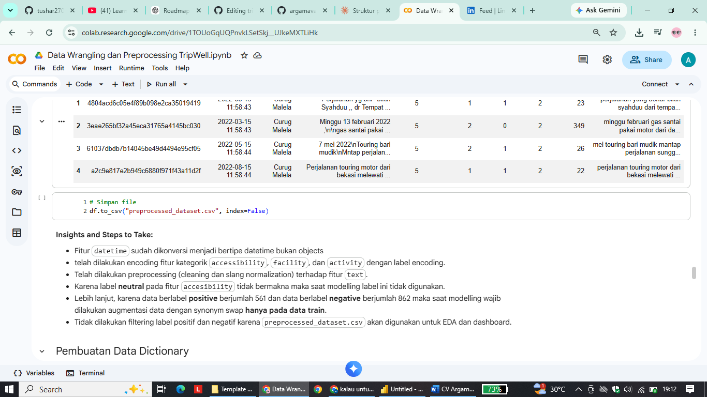

# Tripwell Capstone Contribution

## Project Description:
TripWell is an AI-powered inclusive tourism platform designed to help users identify whether a tourist destination is accessible for people with mobility limitations, such as wheelchair users, elderly visitors, and families with strollers.

This project focuses on analyzing Indonesian tourism reviews using Deep Learning and Natural Language Processing (NLP) techniques.

The AI system automatically classifies tourism reviews into:

- **Ramah Disabilitas** (Accessible)
- **Akses Terbatas** (Limited Accessibility)

This project was developed for:

> Coding Camp 2026 powered by DBS Foundation

## My Role:
Data Analysis & Data Preprocessing

## Contributions:

- Data Wrangling 
- Cleaning Data (Missing value handling, Data type handling)
- Data preprocessing (For modelling)

- Exploratory Data Analysis (EDA)
- Data visualization

## Insights:

## Project Repository:
[(link repository utama)](https://github.com/lailykhoiriyah/capstoneproject/tree/main)
